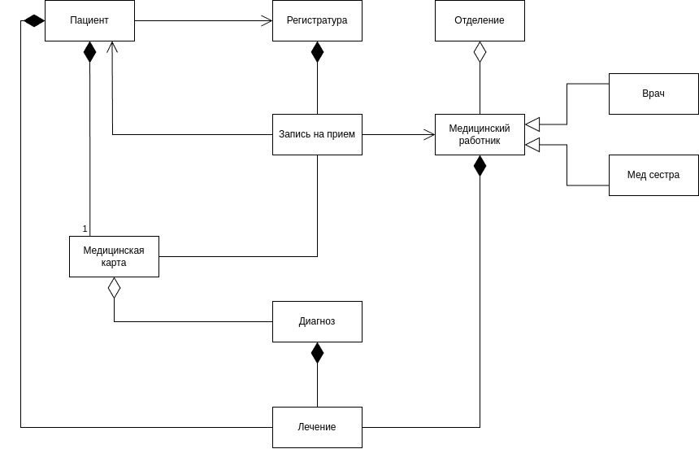
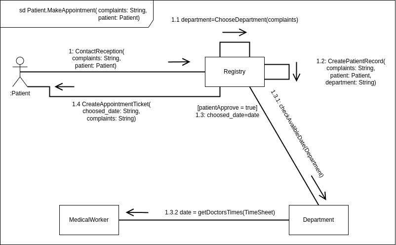
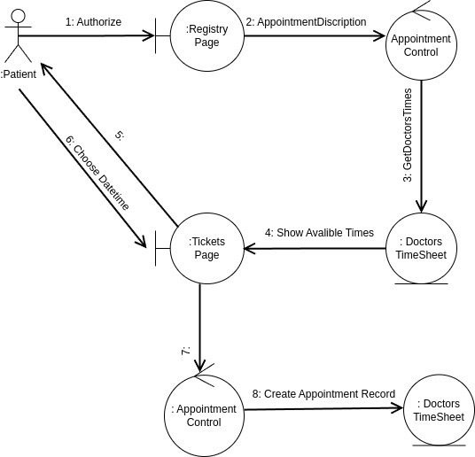

# МПО
## Описание сущностей
1. Регистратура:
    - Основное место, где пациенты записываются на прием к медицинским работникам. Регистратура управляет процессом записи и предоставляет информацию о доступных специалистах.

2. Отделение:
    - Структурное подразделение больницы, в котором работают медицинские работники. Отделения могут быть специализированными (например, хирургия, терапия и т.д.)

3. Пациент:
   - Лицо, получающее медицинские услуги. Каждый пациент имеет уникальную медицинскую карту, которая хранит всю информацию о его здоровье и лечении.

4. Запись на прием:
   - Документ, фиксирующий информацию о предстоящем визите пациента к медицинскому работнику. Запись на прием создается в регистратуре и связана с конкретным пациентом и медицинским работником.

5. Медицинский работник:
   - Сотрудник больницы, который предоставляет медицинские услуги. В данной модели выделяется две категории: врачи и медсестры.
   
6. Медицинская карта:
   - Документ, содержащий полную информацию о состоянии здоровья пациента, включая историю болезни, диагнозы и проведенные лечения. Каждая медицинская карта принадлежит только одному пациенту.

7. Диагноз:
   - Описание состояния здоровья пациента, установленное медицинским работником на основе обследования и анализов. Диагноз фиксируется в медицинской карте.

8. Лечение:
   - Процесс оказания медицинских услуг пациенту на основе установленного диагноза. Лечение может включать назначение медикаментов, процедур и др.

## Сама диаграмма 

# ДК
## Описание взаимодействия
- 1.0 Пациент контактирует с Регистратурой и передает свои жалобы.

- 1.1 На основе жалоб пациента Регистратура определяет подходящее Отделение, в которое он будет направлен.

- 1.2 Регистратура формирует Запись на прием к медицинскому работнику.

- 1.3 Регистратура запрашивает свободное время для приема у Медицинских работников из выбранного Отделения, пока пациент не согласует время.

- 1.4 После согласования времени создается запись в Медицинской карточке пациента, фиксирующая его жалобы и согласованное время приема.

## Сама диаграмма

# ДА

## Описание

1. Пациент заходит на сайт регистратуры больницы, используя аккаунт госуслуг (регистрация пользователя не требуется).
   
2. Пациент выбирает интересующего его врача и описывает свои жалобы.

3. Информация о выбранных врачах и жалобах передается в Appointment Control.

4. Appointment Control запрашивает доступ к базе данных с расписанием выбранных врачей.

5. Расписания передаются на страницу TicketsPage.

6. Пациент просматривает доступные для приема времена.

7. Пациент выбирает удобное время на странице TicketsPage.

8. Выбранное время передается обратно в Appointment Control.

9. Appointment Control фиксирует выбранное время приема в расписании врача.

## Сама диаграмма

