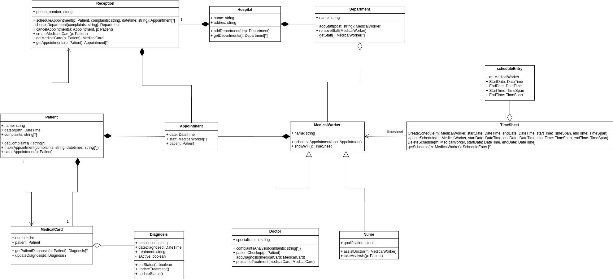
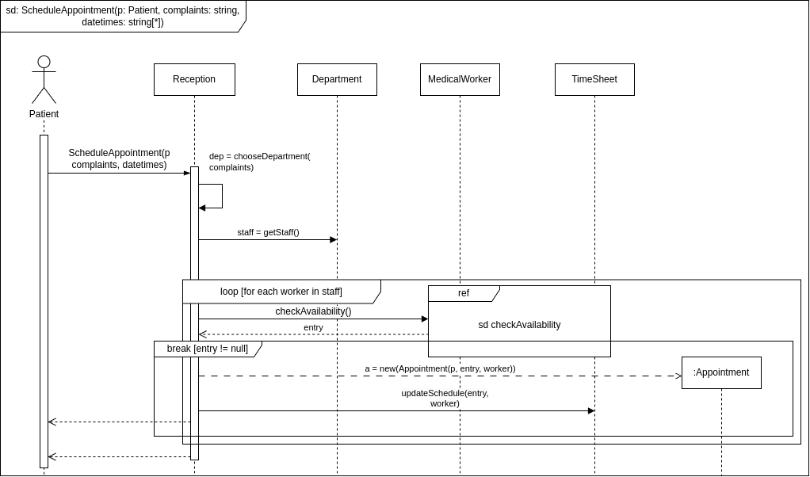
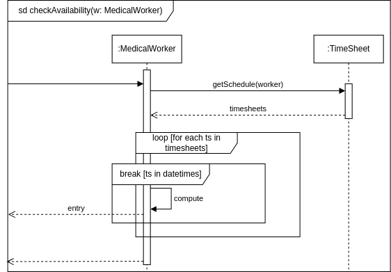
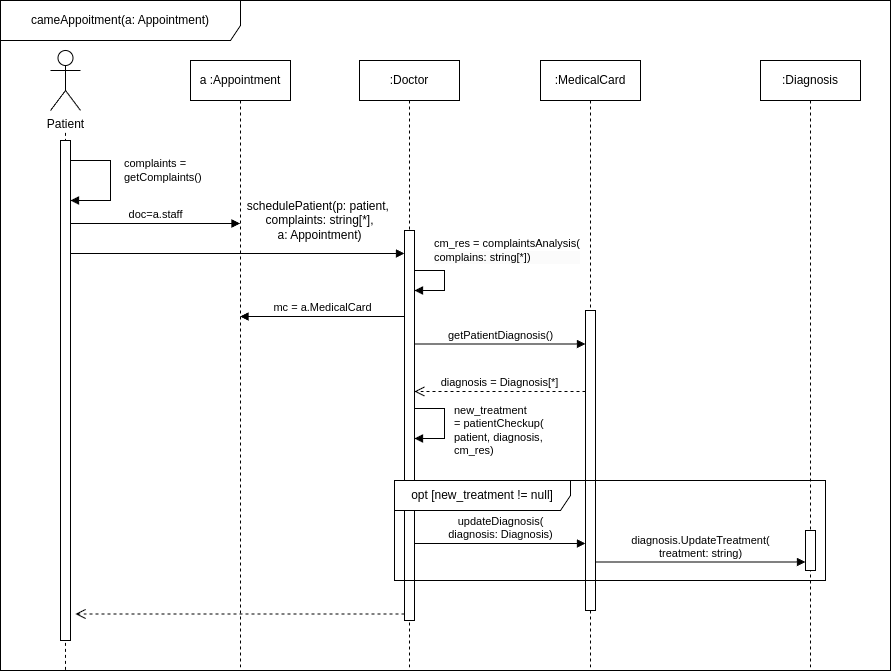

# Диаграмма Классов
## Текстовое описание

1. **Hospital (Больница)**
   - Атрибуты:
     - `name: string` (имя)
     - `address: string` (адрес)
   - Методы:
     - `addDepartment(dep: Department)` (добавить отделение)
     - `getDepartments(): Department[*]` (получить список отделений)

2. **Department (Отделение)**
   - Атрибуты:
     - `name: string` (имя)
     - `staff: MedicalWorker[*]` (персонал)
   - Методы:
     - `addStaff(post: string): MedicalWorker` (добавить сотрудника)
     - `removeStaff(MedicalWorker)` (удалить сотрудника)
     - `getStaff(): MedicalWorker[*]` (получить список сотрудников)

3. **MedicalWorker (Медицинский работник)**
   - Атрибуты:
     - `name: string` (имя)
     - `workingHours: TimeSheet` (рабочие часы)
   - Методы:
     - `scheduleAppointment(app: Appointment)` (запланировать прием)
     - `showWH(): TimeSheet` (показать рабочие часы)
   
4. **Doctor (Доктор)**
   - Атрибуты:
     - `specialization: string` (специализация)
   - Методы:
     - `complaintsAnalysis(complaints: string[*])` (анализ жалоб)
     - `patientCheckup(p: Patient)` (осмотр пациента)
     - `addDiagnosis(medicalCard: MedicalCard)` (добавить диагноз)
     - `prescribeTreatment(medicalCard: MedicalCard)` (назначить лечение)

5. **Nurse (Медсестра)**
   - Атрибуты:
     - `qualification: string` (квалификация)
   - Методы:
     - `assistDoctor(m: MedicalWorker)` (помощь доктору)
     - `takeAnalysis(p: Patient)` (взять анализы)

6. **Patient (Пациент)**
   - Атрибуты:
     - `name: string` (имя)
     - `dateofBirth: string` (дата рождения)
     - `complaints: string[*]` (жалобы)
     - `appointments: Appointment[*]` (приемы)
     - `mc: MedicalCard` (медицинская карта)
   - Методы:
     - `getComplaints(): string[*]` (получить жалобы)
     - `makeAppointment(complaints: string, datetimes: string[*])` (записаться на прием)
     - `cameAppointment(p: Patient)` (пришел на прием)

7. **Appointment (Прием)**
   - Атрибуты:
     - `dateTime: string` (дата и время)
     - `staff: MedicalWorker[*]` (персонал)
     - `patient: Patient` (пациент)
     - `mc: MedicalCard` (медицинская карта)

8. **MedicalCard (Медицинская карта)**
   - Атрибуты:
     - `number: int` (номер)
     - `patient: Patient` (пациент)
     - `diagnosisList: Diagnosis[*]` (список диагнозов)
   - Методы:
     - `getPatientDiagnosis(p: Patient): Diagnosis[*]` (получить диагнозы пациента)
     - `updateDiagnosis(d: Diagnosis)` (обновить диагноз)

9. **Diagnosis (Диагноз)**
   - Атрибуты:
     - `description: string` (описание)
     - `dateDiagnosed: string` (дата диагноза)
     - `treatment: string` (лечение)
     - `isActive: boolean` (активен)
   - Методы:
     - `getStatus(): boolean` (получить статус)
     - `updateTreatment()` (обновить лечение)
     - `updateStatus()` (обновить статус)

10. **Reception (Регистратура)**
    - Атрибуты:
      - `phone_number: string` (номер телефона)
    - Методы:
      - `scheduleAppointment(p: Patient, complaints: string, datetime: string): Appointment[*]` (записать на прием)
      - `chooseDepartment(complaints: string): Department` (выбрать отделение)
      - `cancelAppointment(a: Appointment, p: Patient)` (отменить прием)
      - `createMedicineCard(p: Patient)` (создать медицинскую карту)
      - `getMedicalCard(p: Patient): MedicalCard` (получить медицинскую карту)
      - `getAppointments(p: Patient): Appointment[*]` (получить приемы)

11. **TimeSheet (График работы)**
    - Атрибуты:
      - `se: ScheduleEntry[*]` (запись в расписании)
    - Методы:
      - `CreateSchedule(m: MedicalWorker, startDate: DateTime, endDate: DateTime, startTime: TimeSpan, endTime: TimeSpan)` (создать расписание)
      - `UpdateSchedule(m: MedicalWorker, startDate: DateTime, endDate: DateTime, startTime: TimeSpan, endTime: TimeSpan)` (обновить расписание)
      - `DeleteSchedule(m: MedicalWorker, startDate: DateTime, endDate: DateTime)` (удалить расписание)
      - `GetWorkingDays(m: MedicalWorker): ScheduleEntry[*]` (получить записи в расписании)
      - 
12. **ScheduleEntry (Запись в расписании)**
    - Атрибуты:
      - `m: MedicalWorker` (медицинский работник)
      - `StartDate: DateTime` (дата начала)
      - `EndDate: DateTime` (дата окончания)
      - `StartTime: TimeSpan` (время начала)
      - `EndTime: TimeSpan` (время окончания)

## Диаграмма

# Диаграмма(мы) последовательностей

## SD1
### Текстовое описание

Эта диаграмма описывает процесс записи пациента на прием. Основные шаги включают:
1. Пациент вызывает метод makeAppointment с параметрами complaints и datetimes.
2. Регистратура выбирает подходящий департамент на основе жалоб пациента.
3. Департамент запрашивает доступный персонал.
4. Для каждого медицинского работника проверяется его доступность.
5. Если работник свободен, назначается встреча.
6. Обновляется расписание.
### Диаграмма

## SD2
### Текстовое описание
Эта диаграмма описывает процесс проверки доступности медицинского работника. Основные шаги включают:
1. Медицинский работник запрашивает свое расписание.
2. Система возвращает список расписаний.
3. Для каждого расписания проверяется, входит ли оно в указанные даты.
4. Если да, возвращается true, иначе false.
### Диаграмма

## SD3
### Текстовое описание
Эта диаграмма описывает процесс приема пациента на прием. Основные шаги включают:
1. Пациент приходит на прием.
2. Врач запрашивает жалобы пациента.
3. Проводится анализ жалоб.
4. Врач запрашивает диагноз пациента.
5. Если диагноз требует обновления, он обновляется.
6. Проводится осмотр пациента.
7. Если лечение неэффективно, обновляется диагноз и лечение.
### Диаграмма

# Диаграмма объектов

## Текстовое описание
Диаграмма объектов представляет собой структуру медицинского учреждения, включающую больницу, отделения, врачей и медсестер. Ниже приведено описание элементов диаграммы:

1. **Больница**
	- **hosp: Hospital**
	  - **name**: "ОГАУЗ Межвузовская поликлиника"
	  - **address**: "г. Томск Киевская 74"
	  
1. **Отделения**
	- **dep1: Department**
	  - **name**: "Хирургическое отделение"
	- **dep2: Department**
	  - **name**: "Терапевтические отделение"
	- **dep3: Department**
	  - **name**: "Отделение Анестезиологии и реанимации"

3. **Врачи**
	- **dep1_doc1: Doctor**
	  - **name**: "Иванов Иван Иванович"
	  - **specialization**: "Хирург"
	
	- **dep1_doc2: Doctor**
	  - **name**: "Петрова Анна Сергеевна"
	  - **specialization**: "Ортопед"
	
	- **dep2_doc1: Doctor**
	  - **name**: "Сидоров Алексей Викторович"
	  - **specialization**: "Терапевт"
	
	- **dep2_doc2: Doctor**
	  - **name**: "Кузнецова Мария Анатольевна"
	  - **specialization**: "Эндокринолог"

	- **dep3_doc1: Doctor**
	  - **name**: "Федоров Сергей Владимирович"
	  - **specialization**: "Анестезиолог-реаниматолог"

4.  **Медсестры**
	- **dep1_nurse1: Nurse**
	  - **name**: "Коваленко Татьяна Васильева"
	  - **qualification**: "Старшая медсестра: Хирургия"
	
	- **dep1_nurse2: Nurse**
	  - **name**: "Романова Елена Сергеевна"
	  - **qualification**: "Медсестра: Операционное дело"
	
	- **dep1_nurse3: Nurse**
	  - **name**: "Егорова Наталья Сергеевна"
	  - **qualification**: "Медсестра: Хирургия"
	  
	- **dep2_nurse1: Nurse**
	  - **name**: "Павлова Ирина Владимировна"
	  - **qualification**: "Медсестра: Терапия"
	
	- **dep3_nurse1: Nurse**
	  - **name**: "Николаева Светлана Васильевна"
	  - **qualification**: "Медсестра: Реанимация"

5. Регистратура
	- **reception: Reception**
	  - **phone_number**: "81234567890"

## Диаграмма
