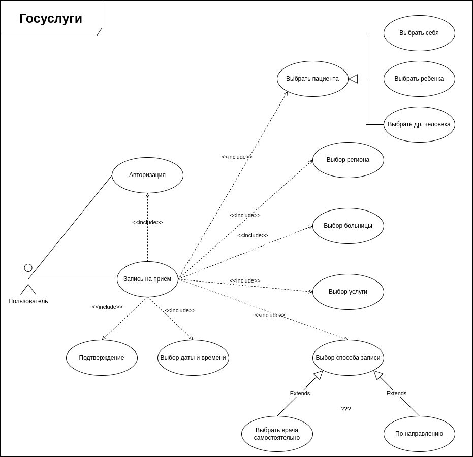

# Анализ функциональных требований по ресурсам платной клиники и госуслуг

## Госуслуги
Диаграмма представляет собой диаграмму вариантов использования для госуслуг. Она включает следующие элементы:

1. **Актор: Пользователь**
2. **Варианты использования:**
   - **Записаться на прием**
     - Включает:
       - **Авторизация**
       - **Выбор региона**
       - **Выбор больницы**
       - **Выбор услуги**
       - **Выбор способа записи**
       - **Выбор даты и времени**
       - **Подтверждение**
   - **Выбрать пациента**
     - Включает:
       - **Выбрать себя**
       - **Выбрать ребенка**
       - **Выбрать др. человека**
   - **Выбрать врача самостоятельно**
     - Расширяет **Выбор способа записи**
   - **По направлению**
     - Расширяет **Выбор способа записи**
### Диаграмма

## Платная клиника

Диаграмма представляет собой диаграмму вариантов использования для платной клиники. Она включает следующие элементы:

1. **Актор: Пользователь**
2. **Варианты использования:**
   - **Записаться на прием**
     - Включает:
       - **Указать ФИО**
       - **Указать контактную информацию**
       - **Указать дату и время**
   - **Изменить время приема**
     - Расширяет **Записаться на прием**
   - **Отменить запись**
     - Расширяет **Записаться на прием**

### Диаграмма

# Сценарий использования: Записаться на прием
## Акторы:
- Пользователь
- Система
## Основной поток:
1. **Пользователь**: Авторизуется в системе.
   - **Система**: Проверяет учетные данные пользователя и подтверждает авторизацию.

2. **Пользователь**: Выбирает услугу.
   - **Система**: Отображает список доступных услуг.

3. **Пользователь**: Выбирает врача.
   - **Система**: Отображает список доступных врачей для выбранной услуги.

4. **Пользователь**: Выбирает дату и время приема.
   - **Система**: Отображает доступные слоты для выбранного врача.

5. **Пользователь**: Подтверждает запись на прием.
   - **Система**: Сохраняет запись на прием и отправляет подтверждение пользователю.
## Альтернативные потоки:
- **Альтернативный поток 1**: Пользователь не авторизован.
  - **Система**: Предлагает пользователю зарегистрироваться или авторизоваться.

- **Альтернативный поток 2**: Пользователь отменяет запись.
  - **Пользователь**: Выбирает опцию отмены записи.
  - **Система**: Отменяет запись и уведомляет пользователя.

- **Альтернативный поток 3**: Пользователь изменяет запись.
  - **Пользователь**: Выбирает опцию изменения записи.
  - **Система**: Предлагает пользователю выбрать новую дату и время.
  - **Пользователь**: Подтверждает изменения.
  - **Система**: Сохраняет изменения и уведомляет пользователя.

## Диаграмма

