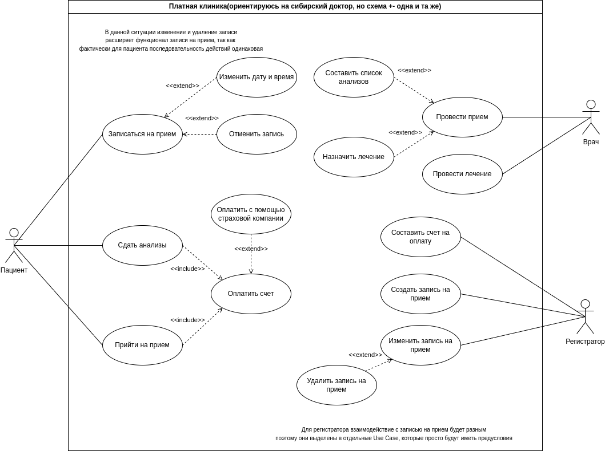
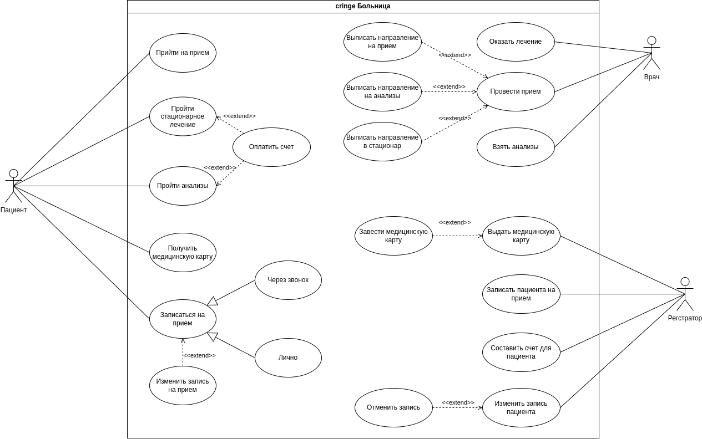

Рассмотрено было две клиники: государственная и частная(Сибирский доктор, хотя для частных клиник сценарий в общем случае будет такой же). В целом функции всех сервисов между собой будут схожи
## Государственная больница
Диаграмма представляет собой диаграмму вариантов использования для государственной больницы. Она включает следующие элементы:

**Акторы:** *Пациент, Врач, Регистратор*

**Пациент** - основной пользователь сервиса, может инициировать следующие действия:
- Прийти на прием - в данном случае подразумевается, что у пациента есть назначенный прием, на который он может прийти
- Пройти стационарное лечение - пациент приходит в больницу по направлению в стационар или по какой-нибудь объективной причине и ложится в стационар
- Пройти анализы - пациент приходит в больницу по направлению или в др. любое рабочее время и сдает анализы
- Получить медицинскую карту - пациент получает свою медицинскую карту
- Записаться на прием - функция по которой пациент записывается на прием, при этом она обобщает варианты: Через звонок, Через госуслуги, Через регистратуру

*Оплатить счет -* расширяет функционал *Прийти на прием, Пройти стационарное лечение, Пройти анализы*  

**Врач** - выполняет услуги, которые связаны с обслуживанием пациента(медицинского характера), может инициировать следующие действия:
- Провести осмотр пациента - в данном сценарии подразумевается, что пациент пришел на прием к врачу, врач проводит необходимые, на свое усмотрение, действия, исходя из которых может: *Назначить лечение, Выписать направление на анализы, Выписать направление в стационар*
- Провести лечение - в данном сценарии подразумевается, что пациент уже был осмотрен врачом, после чего могут производиться операции, например хирургического плана 

**Регистратор** - выполняет услуги, которые связаны с обслуживанием пациента(бюрократического характера), может инициировать следующие действия:
- Выдать медицинскую карту - в данном сценарии регистратор выдает пациенту медицинскую карту, если у пациента ее нет, то она может быть заведена с помощью функционала: *Завести медицинскую карту*
- Записать пациента на прием - в данном сценарии регистратор записывает пациента на прием
- Составить счет для пациента - если пациент воспользовался платными услугами больницы, то ему будет выставлен счет на регистратуре  
### Диаграмма

## Платная клиника
Диаграмма представляет собой диаграмму вариантов использования для государственной больницы. Она включает следующие элементы:

**Акторы:** *Пациент, Врач, Регистратор*

**Пациент** - основной пользователь сервиса, может инициировать следующие действия:
- Прийти на прием - в данном случае подразумевается, что у пациента есть назначенный прием, на который он может прийти
- Сдать анализы - пациент приходит в больницу и сдает анализы.  По предварительному направлению или в любое другое время
- Записаться на прием - функция по которой пациент записывается на прием, при этом она расширяется вариантами: *изменить дату и время, отменить запись*. В данной ситуации, предполагается сценарий, когда пациент звонит в платную клинику, идентифицирует себя, а после записывается на прием, в расширенных вариантах порядок действий остается примерно таким же, разве что с дополнительными репликами, поэтому он был вынесен в extend

*Оплатить счет -* обязательный функционал для: *Прийти на прием, Сдать анализы*, тк клиника является частной, может быть расширена вариантом *Оплатить с помощью страховой компании*, например когда у пациента есть ДМС, который распространяется на данную клинику  

**Врач** - выполняет услуги, которые связаны с обслуживанием пациента(медицинского характера), может инициировать следующие действия:
- Провести прием - в данном сценарии подразумевается, что пациент пришел на прием к врачу, врач проводит необходимые, на свое усмотрение, действия, исходя из которых может: *Составить список необходимых анализов, Назначить лечение*
- Провести лечение - в данном сценарии подразумевается, что пациент уже был осмотрен врачом, после чего могут производиться операции, например хирургического плана 

**Регистратор** - выполняет услуги, которые связаны с обслуживанием пациента(бюрократического характера), может инициировать следующие действия:
- Создать запись на прием - в данном сценарии регистратор записывает пациента на прием
- Отменить запись на прием - в данном сценарии регистратор отменяет запись пациента на прием
- Изменить данные приема - в данном сценарии регистратор может изменить информацию о приеме, может быть расширено функционалом *Отменить запись на прием*
- Составить счет на оплату - счет, который пациент должен оплатить за предоставленные ему услуги

Создание, отмена и изменение записи, были выделены в отдельные 

### Диаграмма

## USE CASE диаграмма предметной области
Диаграмма представляет собой диаграмму вариантов использования для предметной области Больница. Она включает следующие элементы:

**Акторы:** *Пациент, Врач, Регистратор*

**Пациент** - основной пользователь сервиса, может инициировать следующие действия:
- Прийти на прием - в данном случае подразумевается, что у пациента есть назначенный прием, на который он может прийти
- Пройти стационарное лечение - пациент приходит в больницу по направлению в стационар или по какой-нибудь объективной причине и ложится в стационар
- Пройти анализы - пациент приходит в больницу по направлению или в др. любое рабочее время и сдает анализы
- Получить медицинскую карту - пациент получает свою медицинскую карту
- Записаться на прием - функция по которой пациент записывается на прием, при этом она обобщает варианты: *Через звонок, Лично*

*Оплатить счет -* расширяет функционал *Пройти стационарное лечение, Пройти анализы*
Изменить запись на прием расширяет функционал *Записаться на прием*, тк предполагается что сценарий действий будет схож

**Врач** - выполняет услуги, которые связаны с обслуживанием пациента(медицинского характера), может инициировать следующие действия:
- Провести прием - в данном сценарии подразумевается, что пациент пришел на прием к врачу, врач проводит необходимые, на свое усмотрение, действия, исходя из которых функционал может быть расширен: *Выписать направление на анализы, Выписать направление в стационар, Выписать напрвление на прием*
- Оказать лечение - в данном сценарии подразумевается, что пациент уже был осмотрен врачом, после чего могут производиться операции, например хирургического плана 
- Взять анализы - в данном сценарии подразумевается, что врач берет анализы у пациента(делает какие-нибудь снимки узи и тп.)

**Регистратор** - выполняет услуги, которые связаны с обслуживанием пациента(бюрократического характера), может инициировать следующие действия:
- Выдать медицинскую карту - в данном сценарии регистратор выдает пациенту медицинскую карту, если у пациента ее нет, то она может быть заведена с помощью расширяющего функционала: *Завести медицинскую карту*
- Записать пациента на прием - в данном сценарии регистратор записывает пациента на прием
- Составить счет для пациента - если пациент воспользовался платными услугами больницы, то ему будет выставлен счет на регистратуре  
- Изменить запись пациента, в данном сценарии регистратор может изменить запись пациента при необходимости, расширяется с помощью функционала *Отменить запись*
## Диаграмма

## Сценарий для use case прийти на прием

| **Название**                | Прийти на прием                                                                                                                                                                                                                                                                                                                                                                                                                                       |
| --------------------------- | ----------------------------------------------------------------------------------------------------------------------------------------------------------------------------------------------------------------------------------------------------------------------------------------------------------------------------------------------------------------------------------------------------------------------------------------------------- |
| **Действующее лицо**        | Пациент, Врач                                                                                                                                                                                                                                                                                                                                                                                                                                         |
| **Цель**                    | Прийти на прием, с целью получить информацию о своем здоровье                                                                                                                                                                                                                                                                                                                                                                                         |
| **Предварительные условия** | 1. Пациент предварительно записан на прием 2. Пациент находится в больнице и способен(в каком либо состоянии) появиться в кабинете к доктора                                                                                                                                                                                                                                                                                                       |
| **Выходные условия**        | Пациент получил рекомендации по лечению                                                                                                                                                                                                                                                                                                                                                                                                               |
| **Нормальный сценарий**     | 1. Пациент заходит в кабинет к врачу 2. Пациент оглашает цель своего визита, проблемы которые его беспокоят 3. Врач делает выводы исходя из ситуации, описанной пациентом 4. Врач проводит осмотр исходя из своих предположений 5. Врач вносит соответствующую запись о результатах осмотра в медицинскую карту пациента 6. Врач назначает пациенту лечение 7. Пациент довольный(или не очень), ознакомился с лечением и идет домой |
| **Альтернативный сценарий** | 1. Пациент заходит в кабинет к врачу 2. Врач производит осмотр пациента 3. Врач классифицирует состояние пациента 4. Врач заносит результаты в медицинскую карту пациента 5. Врач выписывает Направление в стационар для пациента 6. Пациента направляется в стационар для проведения лечения                                                                                                                                          |

