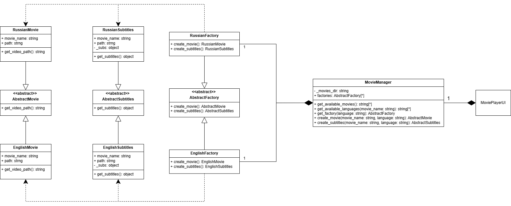

# Задание
Требуется реализовать порождающий паттерн проектированися Абстрактная Фабрика. Идея для реализации программы была взята с примера из файла "Примеры задач", описание того, что требуется реализовать:<br>

```text
Разработать систему Кинопрокат. Пользователь может выбрать определённую киноленту, при заказе киноленты указывается язык звуковой дорожки, который совпадает с языком файла субтитров. Система должна поставлять фильм с требуемыми характеристиками, причём при смене языка звуковой дорожки должен меняться и язык файла субтитров и наоборот.
```

## Описание проекта
Данный проект представляет собой видеоплеер, реализованный на Python с использованием библиотеки PySide6 (Qt для Python). Плеер поддерживает воспроизведение видеофайлов с субтитрами на языках (русский и английский). 

Проект демонстрирует применение порождающего паттерна "Абстрактная Фабрика" и содержит две реализации:
- with_pattern - реализация с применением паттерна проектирования
- without_pattern - реализация без применения паттерна


### With pattern

Для того, чтобы использовать проект(запуская код с паттерном), требуется организовать папку movies следующим образом

```text
movies/
|-- en/
|   |-- [название_фильма].mp4
|   |-- [название_фильма].srt
|-- ru/
|   |-- [название_фильма].mp4
|   |-- [название_фильма].srt
```

### Without pattern
Для того, чтобы использовать проект(запуская код без паттерна), требуется организовать папку movies следующим образом

```text
movies/
|-- en/
|   |-- [название_фильма]/
|   |   |-- [название_фильма].mp4
|   |   |-- [название_фильма].srt
|-- ru/
|   |-- [название_фильма]/
|   |   |-- [название_фильма].mp4
|   |   |-- [название_фильма].srt
```

### Настройка переменных окружения
Для использования программы следует создать файл .env в корневой директории проекта со следующими параметрами:

```
MOVIES_PATH=path
MOVIES_WITHOUT_PATTERN=path

MOVIES_TYPE=movie_type
SUBTITLES_TYPE=srt (default subtitles type, in code used packet pysrt)

UI_WITH_PATTERN=path
UI_WITHOUT_PATTERN=path
```

## Структура проекта
```
movies/
    en/           # Английские фильмы и субтитры
    ru/           # Русские фильмы и субтитры
with_pattern/     # Реализация с паттерном "Абстрактная Фабрика"
    class_diag.png
    main.py
    main.ui
    src/
without_pattern/
    class_diag_without_pattern.png
    main.py
    main.ui
    src/
.env
```

## Запуск приложения

### Запуск версии с паттерном
```bash
cd with_pattern
python main.py
```

### Запуск версии без паттерна
```bash
cd without_pattern
python main.py
```

## Диаграммы классов

### Версия с паттерном "Абстрактная Фабрика"


### Версия без паттерна


## Преимущество использования паттерна
1. Разделение ответственности: Код, использующий паттерн, разделяет логику создания объектов (фильмов и субтитров) от логики их использования. Это делает код более модульным и упрощает его поддержку и расширение.

2. Уменьшение связности: Код, использующий паттерн, не зависит от конкретных классов фильмов и субтитров. Он зависит только от абстрактных интерфейсов. Это уменьшает связность между классами и упрощает изменение реализации.

3. Согласованность: Гарантируется, что фильм и субтитры будут создаваться в соответствии с выбранным языком. В коде без паттерна можно случайно создать фильм на одном языке, а субтитры на другом.

4. Преимущество, которое было замечено во время выполнения работы. При использовании абстрактной фабрики очень легко адаптировать поведение под специфику объекта. Как пример работа с русскими субтитрами. Изначально они идут в кодировке cp1251, которую не позволяет считывать библотека pysrt напрямую, поэтому для корректной обработки русских субтитров достаточно изменить логику загрузки субтитров только в ```RussianSubtitles```.<br>В реализации без паттерна потребовалось бы добавление условных ветвлений, что привело бы к усложнению кода и потенциальному "спагетти-коду" при увеличении количества специфичных случаев. В реализации без паттерна для того, чтобы этого не делать, ВРУЧНУЮ изменялась кодировка каждого файла субтитров. 