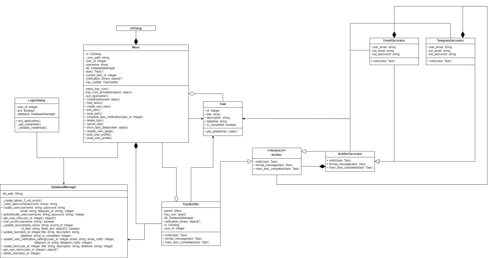
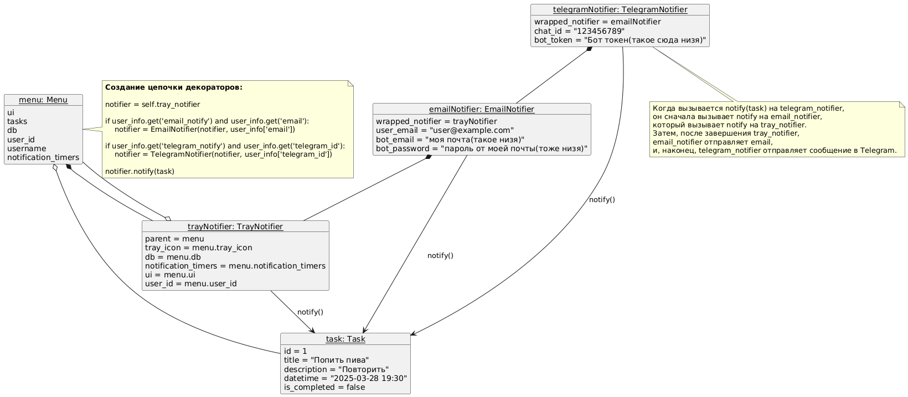

В рамках данной лабораторной работы была реализована система уведомлений для управления задачами с использованием паттерна Декоратор.

### Описание первой реализации.
В исходной версии системы использовался класс `NotificationManager`, который отвечал за отправку уведомлений через три канала: системный трей, электронную почту и Telegram. В данной реализации вся логика находится в классе. Хоть функционал работает корректно, подход имеет ограничение: добавление нового канала уведомлений, например, SMS, потребовало бы изменения существующего кода. Это могло привести к усложнению структуры класса и повысить риск ошибок в уже работающих частях программы.
### Применение паттерна. Вторая реализация. 
Паттерн Декоратор позволяет расширять функциональность объекта, не изменяя его базовую реализацию. Он добавляет новые возможности путем обертывания исходного объекта в дополнительные. 

Классы в коде:
- Абстрактный класс `Notifier`, определяющий интерфейс для всех уведомлений.
- Класс `TrayNotifier`, реализующий базовую отправку уведомлений через системный трей.
- Декораторы `EmailNotifier` и `TelegramNotifier`, наследующиеся от базового класса декоратора `NotifierDecorator`, они добавляют отправку уведомлений по электронной почте и в Telegram соответственно.

Такой подход позволяет комбинировать каналы уведомлений. Например, для отправки через трей и почту достаточно обернуть `TrayNotifier` в `EmailNotifier`. При необходимости можно добавить ещё один слой, например, `TelegramNotifier`.

Диаграмма классов:

Проблемы, решаемые паттерном:
1. **Расширяемость**  
    Добавление нового способа отправки уведомлений сводится к созданию нового декоратора. Это не требует изменений в существующих классах.
2. **Разделение ответственности**  
    Каждый класс или декоратор отвечает за конкретный способ отправки уведомлений. 
3. **Гибкость**
    Возможность комбинировать способы отправки уведомлений позволяет настраивать систему под разные сценарии использования без необходимости усложнять логику основного класса.

Диаграмма объектов при работе всех способов отправки уведомления

### Возможные недостатки
При большом количестве декораторов может усложниться отладка и понимание порядка выполнения. Однако в данном случае, с ограниченным числом каналов, это не оказывает заметного влияния.