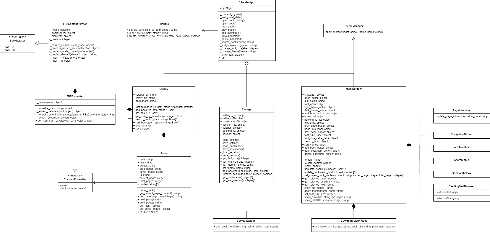

В рамках данной лабораторной работы была реализована приложение для чтения книг в формате FB2 с использованием паттерна Итератор.

### Описание первой реализации (без паттерна).
В исходной версии системы (`without_pattern`) логика парсинга и обхода XML-структуры файла FB2 была реализована внутри класса Book, который напрямую извлекал и хранил все элементы книги. При загрузке файла происходил полный разбор XML-дерева, и все узлы сразу преобразовывались в HTML для отображения. Хоть функционал работал корректно, такой подход имеет ряд недостатков: сложность кода парсинга внутри класса Book, сильная связанность с конкретной структурой FB2 и низкая гибкость при необходимости поддержки разных способов обхода документа.

### Применение паттерна Итератор (вторая реализация).
Паттерн Итератор предоставляет стандартизированный способ последовательного доступа к элементам составного объекта (в данном случае, к элементам FB2-документа), не раскрывая его внутреннего представления. Это позволяет отделить алгоритмы обхода от структуры данных и от клиентского кода, который использует эти данные. На рисунке 1 представлена диаграмма классов приложения.

В версии с паттерном (`with_pattern`) были внесены следующие изменения:
1.  **Создание абстрактного итератора:** Реализован базовый абстрактный класс `Iterator` с методами `__iter__()` и `__next__()`.
2.  **Реализация конкретного итератора:** Создан класс `FB2ContentIterator` в модуле `parsers/fb2.py`, который наследуется от абстрактного итератора и инкапсулирует логику обхода XML-элементов книги.
3.  **Выделение форматтера:** Логика разбора FB2 вынесена в отдельный класс `FB2Formatter` (`parsers/fb2.py`), который наследуется от интерфейса AbstractFormatter, что позволяет классу Book не "задумываться" о логике загрузки текста из книги, а только отображать ее контент
4.  **Использование итератора в форматтере:** Метод `_format_content_into_pages()` в `FB2Formatter` использует итератор для формирования страниц книги, проходя последовательно по всем элементам документа.

Рис. 1. Диаграмма классов приложения для чтения книг с применением петтерна итератор

Проблемы, решаемые паттерном Итератор:
1.  **Разделение ответственности:** Логика навигации по структуре документа FB2 вынесена в отдельный класс-итератор и форматтер, что освобождает остальные элементы бизнес логики не "задумываться" об парсинге книг.
2.  **Инкапсуляция алгоритма обхода:** Сложная логика навигации по иерархической структуре FB2 скрыта внутри конкретного итератора, что делает код более понятным и поддерживаемым.
3.  **Единый интерфейс доступа:** Использование стандартного интерфейса итератора позволяет работать с элементами книги без знания их внутренней структуры и способа хранения.

