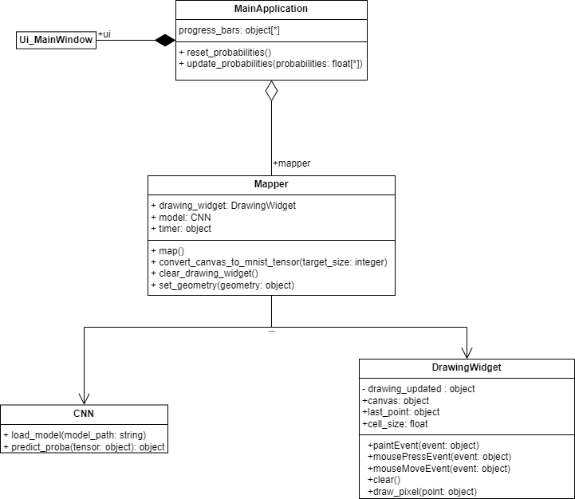

# Лабораторная работа: паттерн Mapper

В работе реализовано интерактивное распознавание рукописных цифр с применением паттерна **Mapper**. Такой подход позволяет четко разделить ответственность между интерфейсом и логикой обработки данных.

## Без паттерна (without_pattern)
В исходной реализации (`without_pattern`):
- Класс `DrawingWidget` и модуль `main.py` одновременно отвечали за:
  - Получение изображения от виджета рисования
  - Предобработку изображения
  - Преобразование в PyTorch тензор 
  - Передачу данных в модель нейронной сети
  - Обновление пользовательского интерфейса

Такой подход приводил к сильной связанности компонентов.

## С паттерном Mapper (with_pattern)
В улучшенной реализации с применением паттерна `Mapper`:

- Вся логика преобразования изображения с холста в тензор PyTorch вынесена в отдельный класс Mapper.
- Интерфейс взаимодействует с этим классом через четко определённый контракт, не зная деталей преобразования.
- Это обеспечивает слабую связанность между UI и обработкой данных.

На рисунке 1 представлена диаграмма классов, демонстрирующая архитектуру приложения с применением паттерна Mapper.

  
   
  <em>Рис. 1. Диаграмма классов приложения с паттерном Mapper</em>

